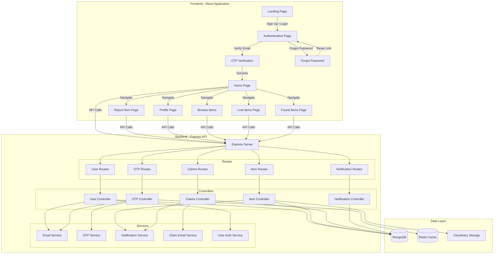
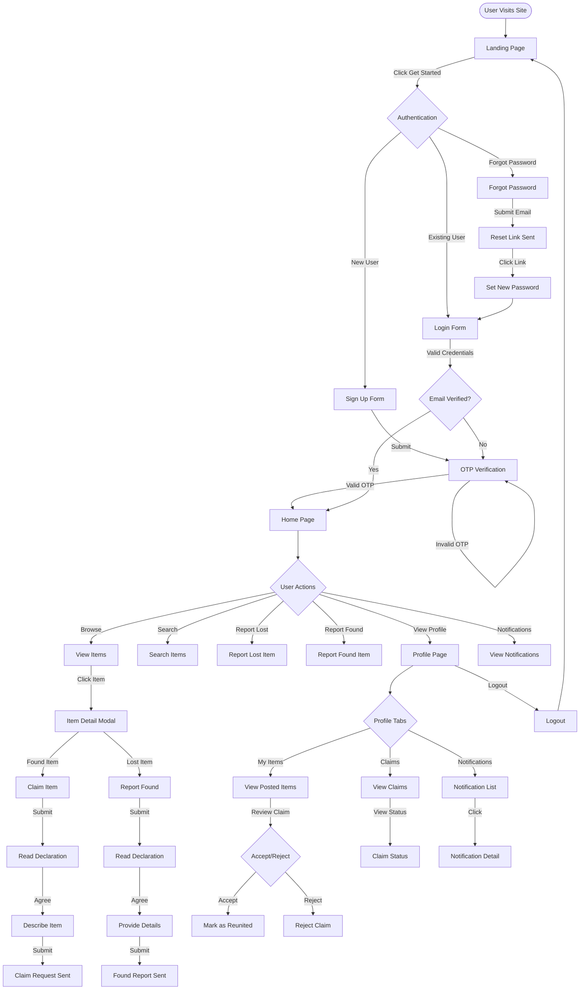
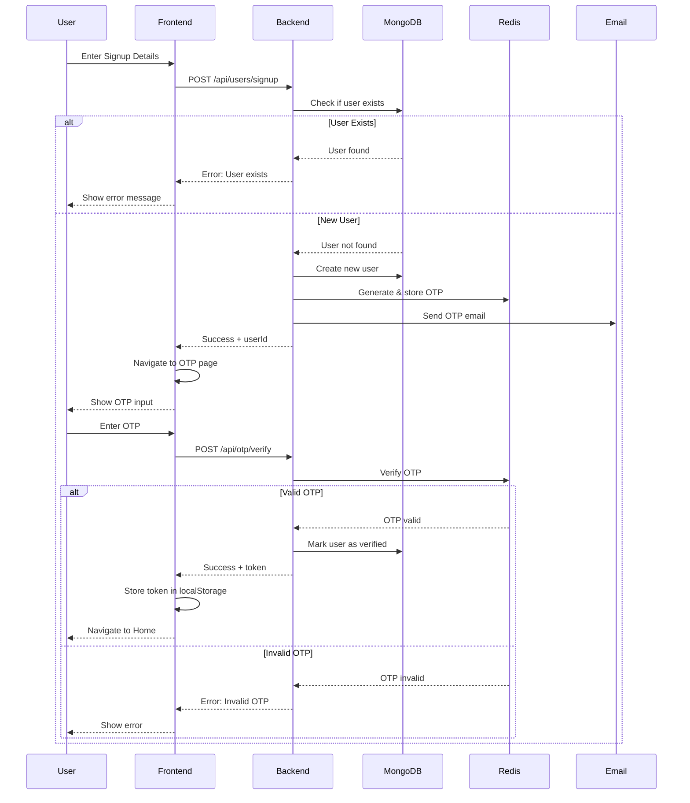
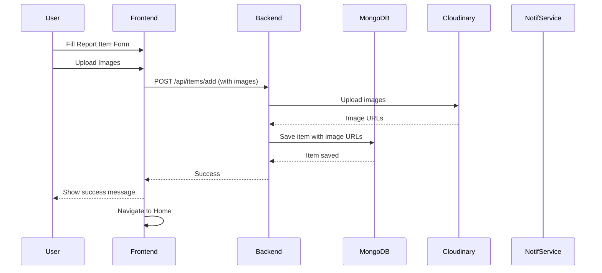
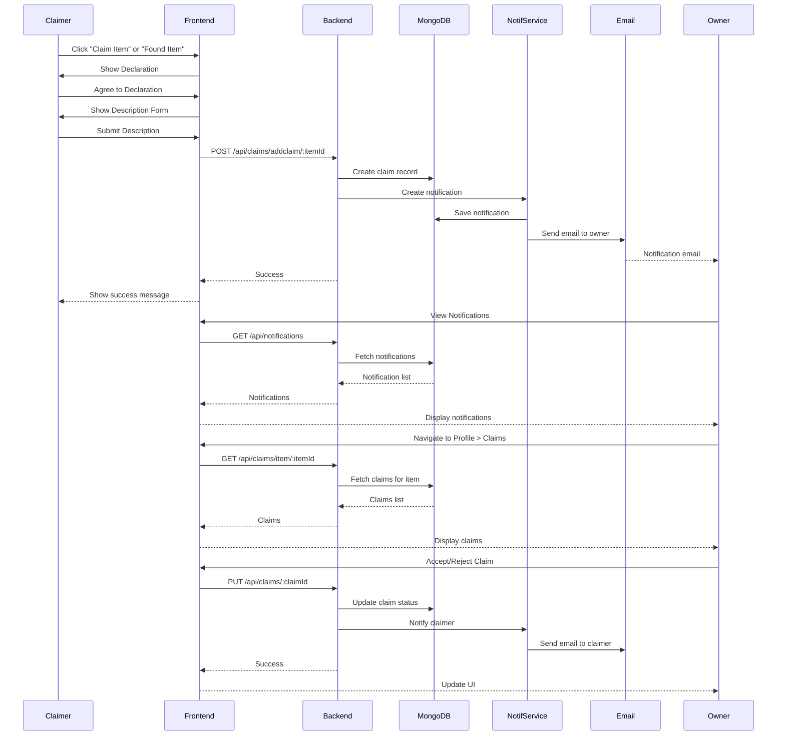
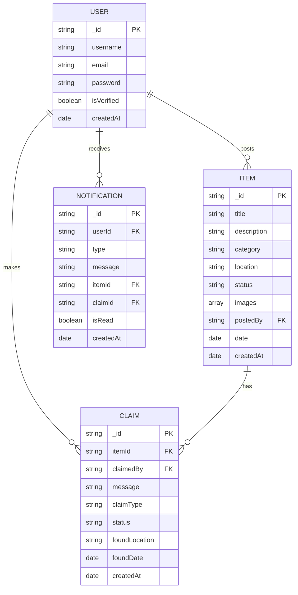
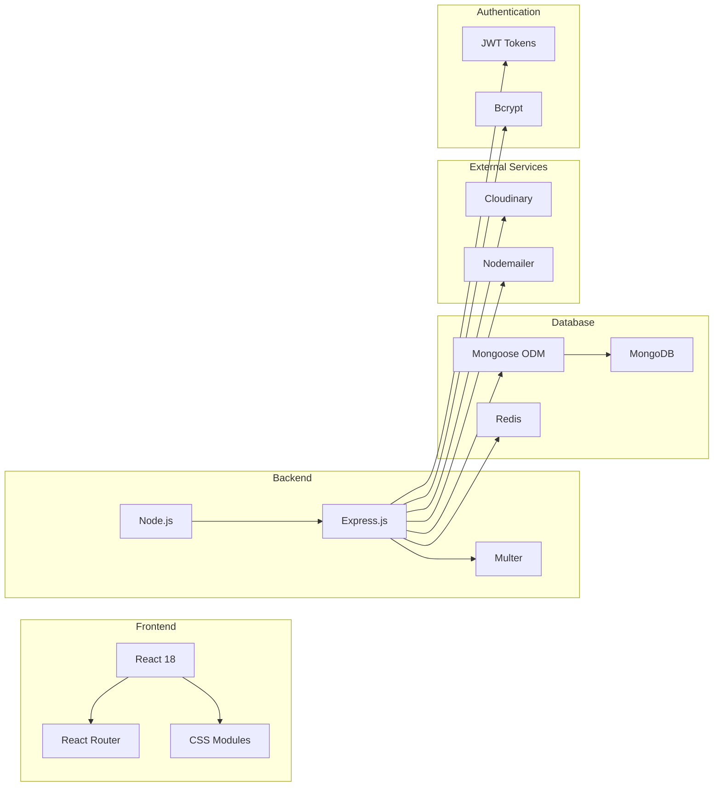

# CampusFindIt - Complete Project Flowchart

## System Architecture Overview

## User Journey Flow

## Authentication Flow

## Item Reporting Flow

## Claim/Found Reporting Flow

## Database Schema

## API Endpoints Overview

### User Routes (`/api/users`)
- `POST /signup` - Register new user
- `POST /login` - Login user
- `POST /forgot-password` - Request password reset
- `POST /reset-password` - Reset password with token
- `GET /me` - Get current user info

### OTP Routes (`/api/otp`)
- `POST /send` - Send OTP to email
- `POST /verify` - Verify OTP code
- `POST /resend` - Resend OTP

### Item Routes (`/api/items`)
- `GET /getall` - Get all items
- `GET /:id` - Get item by ID
- `POST /add` - Create new item (with image upload)
- `PUT /:id` - Update item
- `DELETE /:id` - Delete item
- `GET /user/:userId` - Get items by user

### Claims Routes (`/api/claims`)
- `POST /addclaim/:itemId` - Create claim for item
- `GET /item/:itemId` - Get claims for item
- `GET /user/:userId` - Get claims by user
- `GET /count/:itemId` - Get claim count for item
- `PUT /:claimId` - Update claim status (accept/reject)

### Notification Routes (`/api/notifications`)
- `GET /` - Get user notifications
- `GET /unread-count` - Get unread notification count
- `PUT /:id/read` - Mark notification as read
- `PUT /mark-all-read` - Mark all as read

## Technology Stack

## Key Features

1. **User Authentication**
   - Email/Password signup and login
   - OTP email verification
   - Password reset functionality
   - JWT-based authentication

2. **Item Management**
   - Report lost items
   - Report found items
   - Upload multiple images (Cloudinary)
   - Search and filter items
   - View item details

3. **Claims System**
   - Claim found items
   - Report finding lost items
   - Declaration agreements
   - Owner review and approval
   - Accept/Reject claims

4. **Notifications**
   - Real-time notification count
   - Email notifications
   - In-app notification center
   - Claim status updates

5. **Profile Management**
   - View posted items
   - Manage claims
   - View notifications
   - Update profile

## Security Features

- Password hashing with bcrypt
- JWT token authentication
- OTP verification with Redis
- Protected routes (PrivateRoute)
- CORS configuration
- Input validation
- Secure cookie handling
